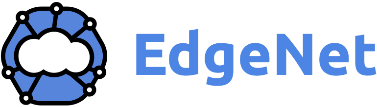

    

# What is EdgeNet?
EdgeNet is a free and open-source cloud orchestration software extension that brings industry-standard cloud software [Kubernetes](https://kubernetes.io/) to the network edge. It allows you to deploy applications to hundreds of nodes that are scattered across the internet, rather than just one or a small number of centralized data centers.

EdgeNet software is different from [EdgeNet-Testbed](https://www.edge-net.org) which is a globally distributed edge cloud running EdgeNet software. If you are interested in joining the testbed and helping non-profit scientific research we encourage you to [contribute a node](https://www.edge-net.org/pages/node-contribution.html).

This repository contains the source code and documentation for EdgeNet software.

# Features
To extend, and adapt Kubernetes into edge computing, EdgeNet employs various features. 

<!-- You can click on them to go through [technical documentation](/docs/custom_resources.md) or see the [detailed concepts](/docs/README.md#concepts). -->
    
* [Multitenancy](/docs/README.md#multitenancy): EdgeNet enables the utilization of a shared cluster by multiple tenants who lack trust in each other. Tenants can allocate resource quotas or slices, and they also have the ability to offer their resources to other tenants. This functionality empowers tenants to function both as providers and consumers, operating in both vendor and consumer modes.

* [Multiprovider](/docs/README.md#multiprovider): By accommodating the collaboration of diverse providers, EdgeNet encourages numerous entities to contribute to nodes, thus fostering a rich and expansive ecosystem that thrives on heterogeneity. With the power of multitenancy, contributors with different hardware can easily lend their hardware.

* [Location-Based Node Selection](/docs/README.md#location-based-node-selection): While the involvement of multiple providers in EdgeNet extends beyond hardware vending, the possibilities encompass a broader spectrum. Node contributions can originate from individuals across the globe, and by leveraging a selective deployment mechanism, EdgeNet empowers the targeted deployment of resources to specific geographical regions, thereby augmenting localization capabilities and enabling efficient utilization of computing power where it is most needed.

* [Federation](/docs/README.md#federation-of-multiple-edgenet-clusters): EdgeNet envisions the federation of Kubernetes clusters worldwide, starting from the edge. By granting clusters the ability to assume workload or federation roles, EdgeNet enables the outsourcing of workloads to these clusters, fostering a seamless and globally interconnected network of distributed computing resources.

# Create an EdgeNet Cluster
To create an EdgeNet cluster you need to have admin access to a Kubernetes cluster. If you want to create one, you can see the Kubernetes cluster created with [minikube](https://kubernetes.io/docs/tutorials/kubernetes-basics/create-cluster/) or [kubeadm](https://kubernetes.io/docs/setup/production-environment/tools/kubeadm/create-cluster-kubeadm/) from the official documentation.

EdgeNet uses [cert-manager](https://cert-manager.io/docs/installation/) to manage certificates. If you don't have `cert-manager` in your Kubernetes cluster please install it first. 

To deploy EdgeNet features to your cluster refer to the [``advanced installation tutorial``](/docs/tutorials/deploy_edgenet_to_kube.md).

# Tutorials and Documentation
If you are planning to use EdgeNet software in your Kubernetes cluster, we highly encourage you to check out the [EdgeNet's documentation](/docs/README.md).

You can access all of [EdgeNet's tutorials](./docs/README.md#tutorials) with the main documentation or by navigating to the `doc` folder in the main repository.

# Support

To chat with a member of the EdgeNet team live, please [open our tawk.to window](https://tawk.to/edgenet).

# Contributing

The EdgeNet software is free and open source, licensed under the [Apache 2.0 license](https://www.apache.org/licenses/LICENSE-2.0); we invite you to contribute. You can access [contribution guide](/docs/guides/contribution_guides.md) for more information on how to contribute.
